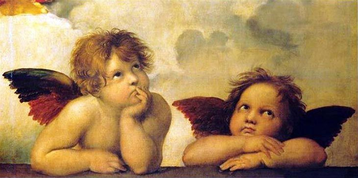

## 1. Prosopopeya o personificación.

Consiste en atribuir propiedades humanas a un animal o a un objeto al que se le hace hablar, actuar y sentir como una persona.

**Ejemplos:**

1. Ropa Interior con la capacidad de Oler
2. Audífonos con opinión musical propia

**Ejercicio:** Escribir una Micro ficción (1 cuartilla) narrando las aventuras o desventuras de este curioso personaje. El narrador debe ser en primera persona y tiempo presente.

**Tiempo Limite:** 15 Minutos.

## 2. Amenaza

Crearemos un personaje simple e indagaremos su lado mas oscuro y consumido por la ira. Escribiremos una nota de amenaza hacia alguien y en ella explicaremos el porque de su agresividad.

**Ejercicio:** Escribir de uno a dos párrafos de una amenaza hecha por nuestro personaje. **NO** se permiten palabras altisonantes. Y debe ser en segunda persona.

**Tiempo Limite:** 5 minutos.

## 3. Los Ángeles de la Capilla Sixtina

Observa la imagen, dale un nombre a cada ángel, personalidad y piensa sobre que hablan.

**Ejercicio:** Elaborar una conversación teatral a partir de la imagen, da un contexto rápido que no pase de dos líneas que expliquOk loe que hacen los ángeles. Dos Cuartillas de extensión.

**Ejemplo**

_Romulo y Remo Observan aburridos el cielo, pues Afrodita les a quitado sus arpas por casi ocasionar otra Gigantomaquia._

**Romulo**: (_jugueteando con su cabello_) ¿No te parece grotesco que estemos desnudos cuando tenemos cuerpos de niños?

**Remo**: _(indiferente)_ Bueno, esa es la razón del porque no hay sacerdotes en el Valhalla.

**Tiempo Limite:** 20 minutos.

## 4. El Colmo de la Mala Suerte

Escribe la historia de una persona a la que solo le pasan desgracias, y sin embargo, se mantiene alegre y optimista. El porque de este gusto por vivir tambien debe ser explicado.

**Ejercicio:** Escribir una cuartilla sobre el personaje creado, narrar sus desventuras y explicar su optimismo. El tipo de narrador debe ser en tercera persona y tiempo pasado.

**Tiempo Limite:** 15 minutos.

## 5. Una Carta de Amor Especial

Piensa en tu crush famoso, en el niño bonito de Disney Channel cuando niña, en tu ido de K-pop favorito, en ese poeta que te pone los pelos de punta o ese hermoso cantante ¡En quien sea! Y escribe la carta de amor mas empalagosa y SIMP del mundo.

**Ejercicio** Escribir una carta de amor de una cuartilla. El narrador debe ser en segunda persona.

**Tiempo Limite:** 10 minutos.
